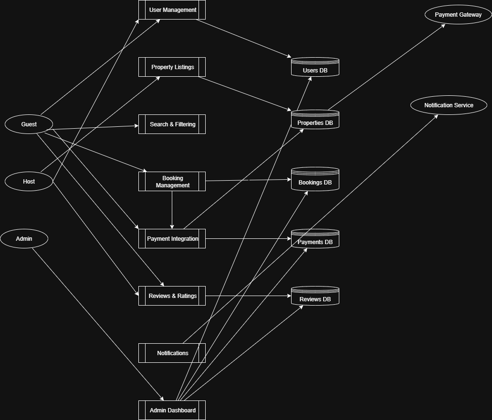

# 🏡 Airbnb Clone Backend Documentation

This repository contains the **backend requirements and documentation** for an Airbnb Clone project.  
It outlines the core functionalities, technical requirements, and non-functional requirements for building a scalable, secure, and efficient rental marketplace system.

---

## 📚 Overview

The goal of this project is to design and document the backend system that powers an Airbnb-like application.  
The documentation highlights how **users, hosts, and admins** interact with the system, covering user management, property listings, bookings, payments, reviews, and notifications.  

This backend is built with a focus on:
- ✅ Scalability  
- ✅ Security  
- ✅ Performance  
- ✅ Reliability  

---

## 🗂 Directory Structure

