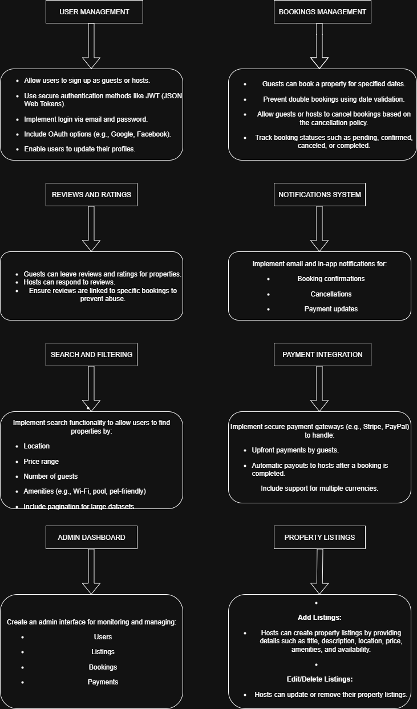

# Backend Features and Functionalities

This document lists all the features and functionalities supported by the backend of the Airbnb Project.

## 📌 Features

1. **User Management**
   - Registration (Guest / Host)
   - Login & Authentication (JWT, OAuth)
   - Profile management

2. **Property Listings**
   - Create / Edit / Delete listings
   - Add details (title, description, location, price, amenities, availability)

3. **Search & Filtering**
   - Search by location, price, guests, amenities
   - Pagination for large datasets

4. **Booking Management**
   - Create bookings (with date validation)
   - Cancel bookings
   - Track booking status (pending, confirmed, canceled, completed)

5. **Payments**
   - Secure payments via Stripe / PayPal
   - Payouts to hosts
   - Multi-currency support

6. **Reviews & Ratings**
   - Guests leave reviews
   - Hosts respond
   - Reviews linked to verified bookings

7. **Notifications**
   - Email + In-app notifications
   - Booking confirmations
   - Payment updates

8. **Admin Dashboard**
   - Manage users, listings, bookings, payments

---

## ⚙️ Technical Requirements

- **Database:** PostgreSQL/MySQL
- **API:** RESTful APIs (GET, POST, PUT, DELETE), GraphQL optional
- **Authentication:** JWT, Role-based Access Control
- **File Storage:** AWS S3 / Cloudinary
- **Email:** SendGrid / Mailgun
- **Error Handling:** Global logging
- **Testing:** pytest, automated API tests

---

## 📂 Diagram

Below is the backend features diagram:

