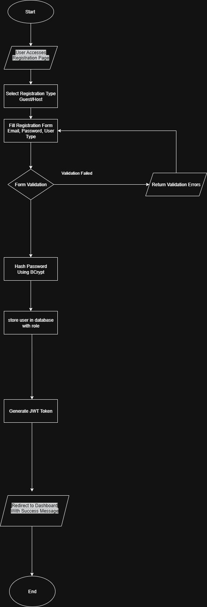

# User Registration Flowchart - ALX Airbnb Project

## 📌 Overview
This document provides a **flowchart representation** of the **User Registration process** in the Airbnb Clone project.  
The flowchart maps out the backend logic and data flow from when a user initiates registration until account creation is completed.

## 🎯 Objective
- To visualize and document the workflow of **User Registration**.  
- To ensure backend processes are clearly defined for implementation.  
- To provide a reference for developers working on **User Management** features.

## 🗂 Directory Structure

