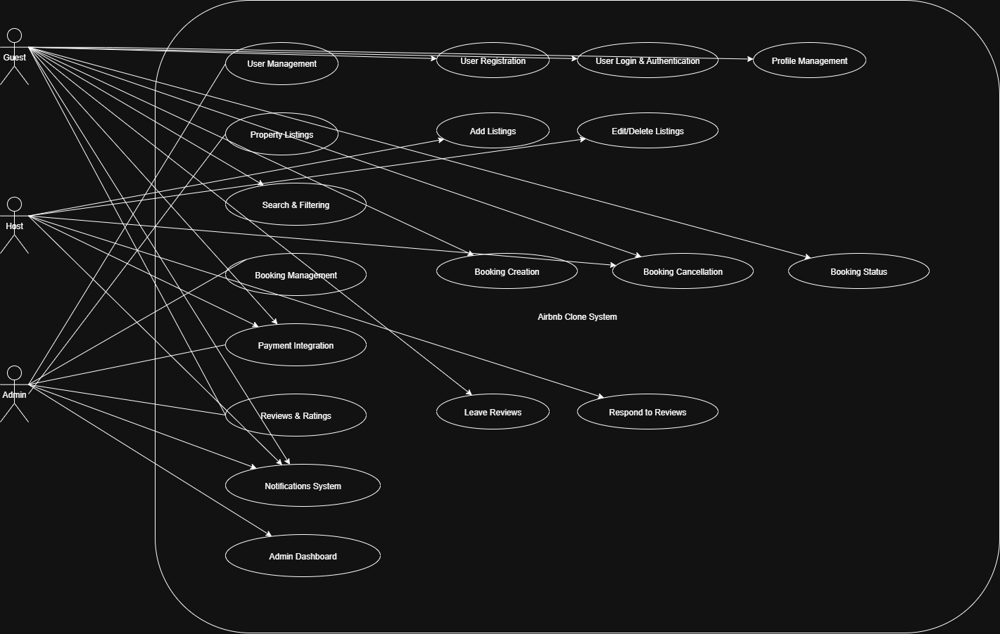

# 🏠 ALX Airbnb Project Documentation

## 📌 Task: Use Case Diagram of the Features and Functionalities

### 🎯 Objective
The objective  is to **visualize system interactions** using a **Use Case Diagram** that captures the key actors and functionalities of the Airbnb Clone backend.

---

## 🔑 Core Functionalities

The backend for the Airbnb Clone must enable the following **core features**, aligned with the functionalities of a rental marketplace:

1. **User Management**
   - User Registration (Guests & Hosts).
   - Login & Authentication (Email/Password, OAuth e.g., Google, Facebook).
   - Profile Management (photos, contact info, preferences).

2. **Property Listings Management**
   - Add Listings (title, description, location, price, amenities, availability).
   - Edit/Delete Listings.

3. **Search and Filtering**
   - Search by location, price range, number of guests, amenities.
   - Pagination for large datasets.

4. **Booking Management**
   - Booking Creation with date validation.
   - Booking Cancellation (guest/host based on policy).
   - Booking Status Tracking (pending, confirmed, canceled, completed).

5. **Payment Integration**
   - Secure payments via Stripe/PayPal.
   - Automatic payouts to hosts after bookings.
   - Multi-currency support.

6. **Reviews and Ratings**
   - Guests leave reviews and ratings for properties.
   - Hosts respond to reviews.
   - Reviews linked to specific bookings.

7. **Notifications System**
   - Email & in-app notifications for bookings, cancellations, and payments.

8. **Admin Dashboard**
   - Manage users, listings, bookings, and payments.

---

## 🛠️ Technical Requirements

- **Database:** PostgreSQL / MySQL  
- **APIs:** RESTful APIs (with GraphQL optional)  
- **Authentication:** JWT + Role-Based Access Control (Guests, Hosts, Admins)  
- **File Storage:** AWS S3 / Cloudinary (property & profile images)  
- **Email Service:** SendGrid / Mailgun  
- **Error Handling & Logging:** Global error handling for APIs  
- **Scalability & Performance:** Caching (Redis), modular architecture, load balancing  
- **Testing:** Unit & integration tests (pytest), automated API testing  

---

## 🚀 Non-Functional Requirements
- **Scalability**: Modular, horizontally scalable architecture.  
- **Security**: Data encryption, firewalls, rate limiting.  
- **Performance Optimization**: Caching + optimized DB queries.  
- **Testing**: Automated tests to ensure reliability.  

---

## 📊 Use Case Diagram

The **Use Case Diagram** has been designed using **Draw.io** to represent interactions between actors (**Guests, Hosts, Admins, Payment Gateway, Notification Service**) and the system.

### 🔗 Diagram Location
The diagram is stored in the repository under:

